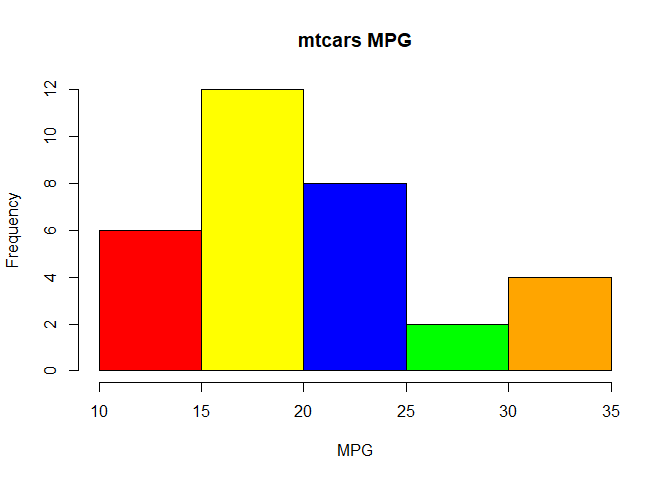
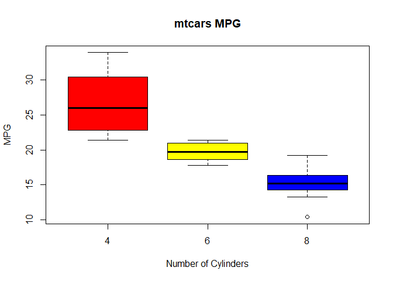

Visual Analytics Module 6 - Basic Graphing in R
================

The first graph I have created is a simple bar chart depicting the number of cars in the 'mtcars' dataset that fit into each interval depending on MPG. While this graph may not be the most accurate or useful, it is an easy to read and simple graph that can get a basic point across.

``` r
colors = c("red","yellow","blue","green","orange")

g1 = hist(mtcars$mpg, main='mtcars MPG', xlab = 'MPG',ylab = 'Frequency',col = colors)
```



``` r
g2 = boxplot(mtcars$mpg ~ mtcars$cyl, main = 'mtcars MPG',xlab='Number of Cylinders', ylab = 'MPG', col = colors,)
```



The second graph I created is a boxplot of the dataset 'mtcars' showing the average MPG for each car subsetted by number of cylinders. I believe this graph is particularly useful because it gives a very clear visual representation of how many MPG a car would get depending on number of cylinders and even here the difference is plain to see.
